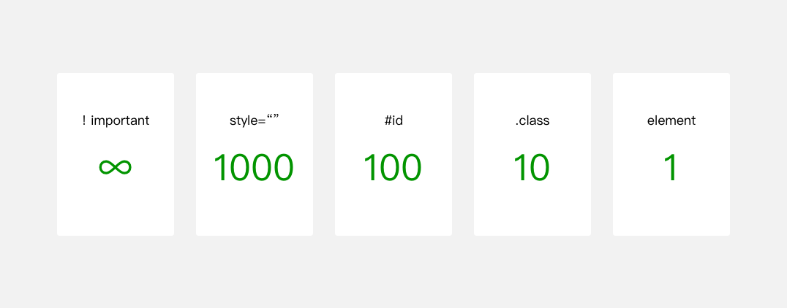

单冒号(:)用于CSS3伪类，双冒号(::)用于CSS3伪元素

伪元素
属性	描述	CSS
:first-letter	向文本的第一个字母添加特殊样式	1
:first-line	向文本的首行添加特殊样式	1
:before	在元素之前添加内容	2
:after	在元素之后添加内容	2

伪类
 属性	描述	CSS
:active	向被激活的元素添加样式	1
:hover	当鼠标悬浮在元素上时，向元素添加样式	1
:focus	向获取焦点的元素添加样式	2
:link	向未被访问过的链接添加样式	1
:first-child	向元素的第一个子元素添加样式	2
:lang	向指定lang属性的元素添加样式	2
:visited	向被访问过的链接添加样式	1
