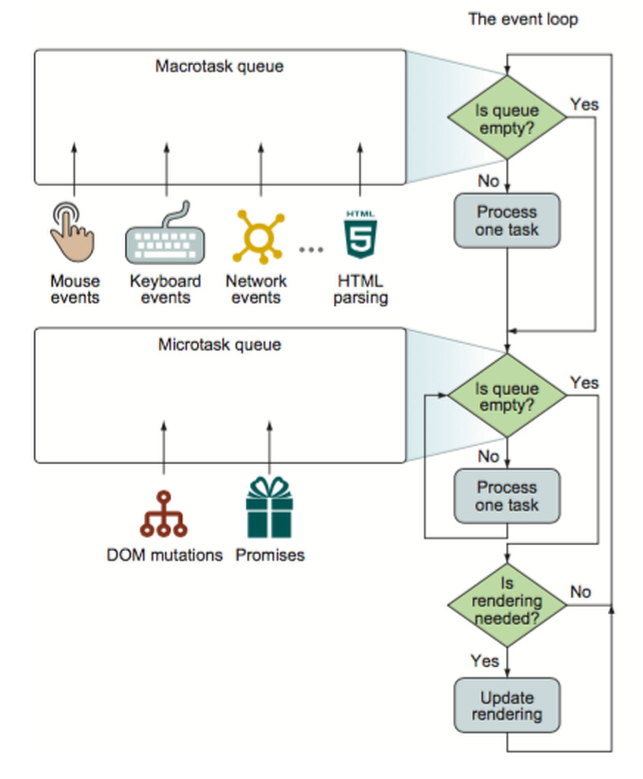
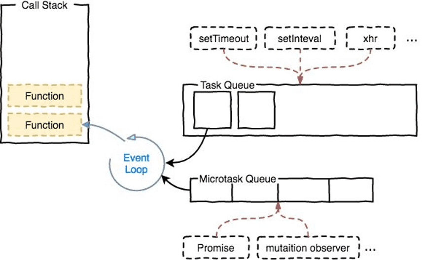
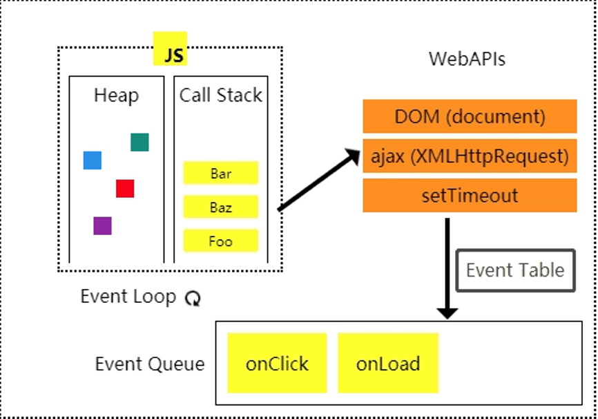

队列（Queue）
队列 是一种 FIFO(First In, First Out) 的数据结构，其特点是先进先出。
就是排队，排在队伍最前面的人先被提供服务。

栈（Stack）
栈，是一种 LIFO（Last In, First Out）的数据结构，其特点是后进先出。
好如子弹装入弹匣，上堂后是最后装入最先被打出。

Event Table
事件->回调函数 的映射关系表，用来暂存异步事件（IO, setTimeout等）及其对应的回调函数

JS 是单线程执行，但是若一个任务耗时太长，那后面的任务就需要等待，可能会存在阻塞用户行为的问题。为了解决这种情况，将任务分为了同步任务和异步任务。同步任务，全局Script代码(类比main入口函数理解)、UI rendering (浏览器独有)；而异步任务又分为了两类 宏任务macrotask(也叫tasks) 和 微任务microtask（也叫jobs）
- 宏任务，macrotask，也叫tasks，这些异步任务源的回调会依次进入macrotask queue，等待后续被调用。异步任务源包括：
- I/O(touch/mouse/keyboard等UI交互事件响应、访问文件、网络请求等)
浏览器中JavaScript与UI共用一个线程，所以其中一个运行中会阻塞另一个
- setTimeout
- setInterval
- MessageChannel
- setImmediate(Node特有)
- requestAnimationFrame(浏览器特有)
- 微任务，microtask，也叫jobs，异步任务源的回调会依次进入microtask queue，等待后续被调用。异步任务源包括：
- Promise(await)
- MutationObserver(浏览器特有)
- process.nextTick(Node特有)

浏览器的运行机制：
1. 执行全局Script代码，可理解成“隐形的”main函数，调用栈Call Stack首个调用的函数（首个task，入口函数，简单理解成 全局同步代码里的方法都是main调用的）。
- 调用栈Call Stack就在JS的主线程执行
- 这些全局Script代码，会有一些是异步任务源（如process.nextTick、Promise.then/catch/finally、setTimeout等）
- 注意：Promise的构造函数、静态方法resolve、reject都是同步调用
- 注意：不是所有的异步任务源(setTimeout等)执行后，其回调都会立即加入对应的任务队列queue的(macrotask or microtask queue)。如一个网络请求(request)，或者一个定时器延迟500ms(setTimeout)，是在对应的事件Event触发后，其回调才会被加入到对应的任务队列queue里的。所以，还有Event Table -- 事件->回调函数的映射关系表，用来暂存异步事件（IO, setTimeout等）及其对应的回调函数。
2. 全局Script同步代码执行完毕后（这里需要强调下是同步代码），调用栈Call Stack会清空。
3. JS引擎中存在一个monitoring process进程，会持续不断的检查主线程调用栈Call Stack是否为空，一旦为空，就会去异步任务队列里检查是否有等待被调用的函数，先微任务队列 microtask queue。
4. 从微任务队列 microtask queue 中取出位于队首的任务(回调函数，microtask queue长度减1)，放入调用栈Call Stack中执行。
5. 执行完后，继续取出位于队首的任务，放入调用栈Call Stack中执行，以此类推，直到把microtask queue中的所有任务都执行完(microtask queue长度为0)。注意，如果在执行microtask的过程中，又产生了microtask，那么会加入到microtask queue的末尾(microtask queue长度+1)，也会在这个周期被调用执行，直到把microtask queue中的所有任务都执行完(microtask queue长度为0)。
6. 微任务都执行完毕后(microtask queue为空队列，长度为0)，此时调用栈 Call Stack也为空，取出宏任务队列 macrotask queue 中取出位于队首的任务(回调函数，macrotask queue长度减1)，放入调用栈Call Stack中执行。
7. 执行完毕后，调用栈Call Stack为空。
8. 重复步骤 3 -> 7

JS的 调用栈Call Stack ，载入函数按顺序一个一个的调用执行，先进后出
这个调用栈，大家经常见到，尤其在控制台报错的时候，错误信息输出的就是当前调用栈的状态
const bar = () => console.log('bar');
const baz = () => console.log('baz');
const foo = () => {
console.log('foo');
    bar();
    baz();
}
foo();

