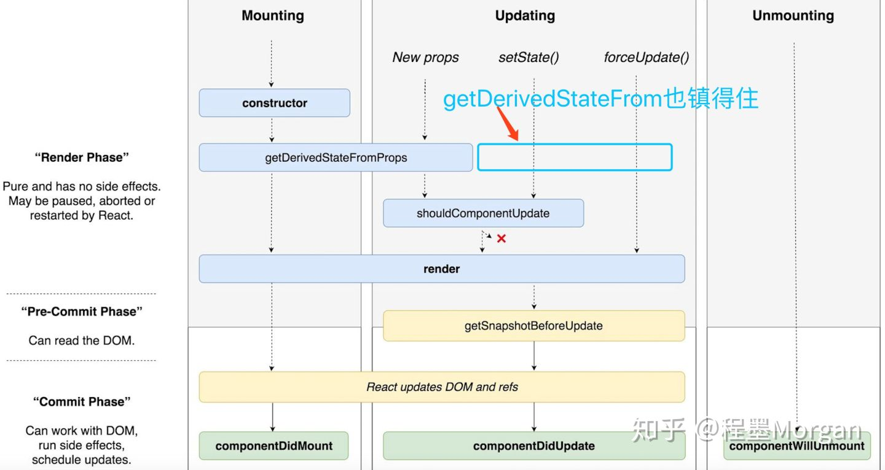

这个生命周期函数的组合在Fiber（React Fiber是什么）之后就显得不合适了，因为，如果要开启async rendering，在render函数之前的所有函数，都有可能被执行多次。长期以来，原有的生命周期函数总是会诱惑开发者在render之前的生命周期函数做一些动作，现在这些动作还放在这些函数中的话，有可能会被调用多次，这肯定不是你想要的结果。

总有开发者问我，为什么不在componentWillMount里写AJAX获取数据的功能，他们的观点是，componentWillMount在render之前执行，早一点执行早得到结果。要知道，在componentWillMount里发起AJAX，不管多快得到结果也赶不上首次render，而且componentWillMount在服务器端渲染也会被调用到（当然，也许这是预期的结果），这样的IO操作放在componentDidMount里更合适。在Fiber启用async render之后，更没有理由在componentWillMount里做AJAX，因为componentWillMount可能会被调用多次，谁也不会希望无谓地多次调用AJAX吧。

这个getDerivedStateFromProps是一个静态函数，所以函数体内不能访问this，简单说，就是应该一个纯函数，纯函数是一个好东西啊，输出完全由输入决定。
  ```javascript
  static getDerivedStateFromProps(nextProps, prevState) {
    //根据nextProps和prevState计算出预期的状态改变，返回结果会被送给setState
  }
  ```

看到这样的函数声明，应该感受到React的潜台词：老实做一个运算就行，别在这里搞什么别的动作。

每当父组件引发当前组件的渲染过程时，getDerivedStateFromProps会被调用，这样我们有一个机会可以根据新的props和之前的state来调整新的state，如果放在三个被deprecate生命周期函数中实现比较纯，没有副作用的话，基本上搬到getDerivedStateFromProps里就行了；如果不幸做了类似AJAX之类的操作，首先要反省为什么自己当初这么做，然后搬到componentDidMount或者componentDidUpdate里面去。

官方给了一个例子，用getSnapshotBeforeUpdate来处理scroll，坦白说，我也想不出其他更常用更好懂的需要getSnapshotBeforeUpdate的例子，这个函数应该大部分开发者都用不上（听得懂我的潜台词吗：不要用！）


用一个静态函数getDerivedStateFromProps来取代被deprecate的几个生命周期函数，就是强制开发者在render之前只做无副作用的操作，而且能做的操作局限在根据props和state决定新的state，而已。