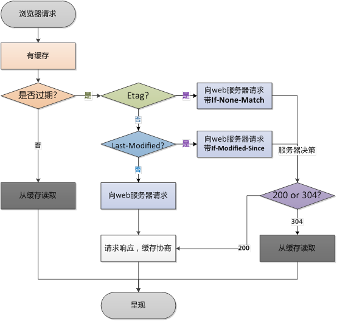

缓存的优点:

减少了不必要的数据传输,节省带宽
减少服务器的负担,提升网站性能
加快了客户端加载网页的速度
用户体验友好
缺点：

资源如果有更改,会导致客户端不及时更新就会造成用户获取信息滞后

当浏览器去请求某个文件的时候，服务端就在respone header里面对该文件做了缓存配置。缓存的时间、缓存类型都由服务端控制

浏览器第一次请求时

浏览器后续在进行请求时

从上图可以知道,浏览器缓存包括两种类型,即强缓存(本地缓存)和协商缓存,浏览器在第一次请求发生后,再次请求时

浏览器在请求某一资源时,会先获取该资源缓存的header信息,判断是否命中强缓存(cache-control)和expires信息,若命中,直接从缓存中获取资源信息,包括缓存header信息,本次请求根本就不会与服务器进行通信 请求头信息
* Accept: ""
* Accept-Encoding: gzip,deflate
* Accept-Language:zh-cn
* Connection: keep-alive
* Host
* Referer
* User-Agent
来自缓存的响应头的信息

Accept-Ranges: bytes
Cache-Control: max-age= xxxx
Content-Encoding: gzip
Content-length: 3333
Content-Type: application/javascript
Date:xxx
Expires: xxx
Last-Modified:xxx
Server: 服务器
如果没有命中强缓存,浏览器会发送请求到服务器,请求会携带第一次请求返回的有关缓存的header字段信息(Last-Modified/If-Modified-Since和Etag/If-None-Match),由服务器根据请求中的相关header信息来比对结果是否协商缓存命中,若命中,则服务器返回新的响应header信息更新缓存中的对应header信息,但是并不返回资源内容,它会告知浏览器可以直接从缓存获取,否则返回最新的资源内容
强缓存与协商缓存的区别,如下所示
类型

获取资源形式

状态码

强缓存

从缓存取

200

协商缓存

从缓存取

304

强缓存相关的header字段

强缓存是直接从缓存中获取资源而不经过服务器,与强缓存相关的header字段有两个

expires:这是http1.0的规范,它的值为一个绝对时间的 GMT 格式的时间字符串,如Mon, 15 Jun 2029 20:08:12 GMT,如果发送请求的时间在expires之前,那么本地缓存始终有效,否则就会发送请求到服务器来获取资源
cache-control: max-age=number,这是http1.1时出现的header信息,主要利用该字段的max-age值来进行判断,它是一个相对值,资源第一次请求时间和Cache-Control设定有效期,计算出一个资源过期时间,在拿这个过期时间跟当前的请求时间比较,如果请求时间在过期时间之前,就能命中缓存,否则就不行,cache-control除了该字段外,还有下面几个比较常用的设置值
no-cache: 不使用本地缓存,需要使用协商缓存,先与服务器确认返回的响应是否被更改,如果之前中存在ETag,那么请求的时候会与服务器验证,如果资源未被更改,则可以避免重新下载
no-store: 直接禁止浏览器缓存数据,每次用户请求该资源,都会向服务器发送一个请求,每次都会下载完整的资源
public: 可以被所有的用户缓存,包括终端用户和 cdn 等中间代理服务器
private: 只能被终端用户的浏览器缓存,不允许 cdn 等中缓存服务器对其缓存
注意

如果cache-control与expires同时存在的话,cache-control的优先级高于expires

协商缓存相关的 header 字段

协商缓存都是由服务器来确定缓存资源是否可用的,所以客户端与服务器端需要某种标识来进行通信,从而让服务器判断请求资源是否可以缓存访问,这主要涉及到下面两组 header 字段

这两组搭档都是成对出现的,即第一次请求的响应头带上某个字段(Last-Modified 或 Etag),则后续请求则会带上对应的请求字段(If-Modified-Since 或 If-Node-Match),若响应头没有Last-Modified或Etag字段,则请求头也不会由对应的字段

Last-Modified/If-Modified-Since
二者的值都是 GMT 格式的时间字符串,具体过程

浏览器第一次跟服务器请求一个资源,服务器在返回这个资源的同时,在response的header加上Last-Modified的header,这个header表示这个资源在服务器上的最后修改时间
浏览器再次跟服务器请求这个资源时,在request的header上加上If-Modified-Since的header,这个header的值就是上一次请求时返回的Last-Modified的值
服务器再次收到资源请求时,根据浏览器传过来的If-Modified-Since和资源在服务器上的最后修改时间判断资源是否有变化,如果没有变化则返回 304 Not Modified,但是不会返回资源内容,如果有变化,就正常返回资源内容,当服务器返回 304 Not Modified 的响应时,response header 中不会再添加 Last-Modified的header,因为既然资源没有变化,那么Last-Modified也就不会改变,这是服务器返回304 的 response header
浏览器收到 304 的响应后,就会从缓存中加载资源
如果协商缓存没有命中,浏览器直接从服务器加载资源时,Last-Modified 的 Header在重新加载的时候会被更新,下次请求时,If-Modified-Since 会启用上次返回的 Last-Modifed 的值
Etag/If-None-Match
这两个值是由服务器生成的每个资源的唯一标识符,只要资源有变化,这个值就会改变,其判断过程与Last-Modified/If-Modified-Since类似,与Last-Modified不一样的是,当服务器返回304 Not Modified的响应时,由于ETag重新生成过,response header中还会把这个ETag返回,即使这个ETag跟之前没有变化

既有Last-Modified又为何有ETag

使用Last-Modified已经足以让浏览器知道本地的缓存副本是否足够新,那为什么还需要Etag呢，HTTP1.1 中ETag的出现主要时为了解决几个Last-Modified比较难解决的问题

一些文件也许会周期性的更改,但是他的内容并不改变(仅仅改变的修改时间),这个时候,我们并不希望客户端认为这个文件被修改了,而重新 get
某些文件修改非常频繁,比如在秒以下的时间内进行修改(比方说 1s 内修改了 N 次),If-Modified-Since能检查到的粒度时 s 级的,这种修改无法判断(或者说 UNIX 记录 MTIME只能精确到秒)
某些服务器不能精确得到的文件的最后修改时间
这时,利用ETag能够更加准确的控制缓存,因为ETag时服务器自动生成或由开发者生成对应资源在服务器端的唯一的标识符

Last-Modified 与 ETag 是可以一起使用的,服务器会优先验证ETag,一致的情况下,才会继续比对Last-Modified,最后才决定是否返回304

以上就是强缓存与协商缓存的学习介绍,每逢面试必问....重要性,你懂的